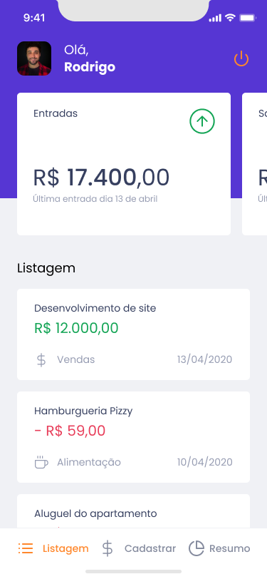
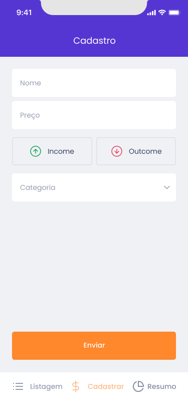
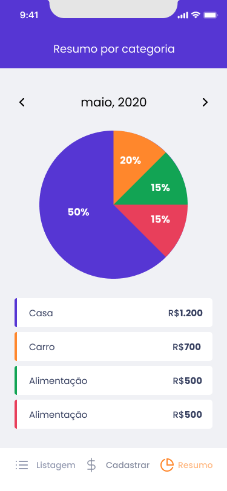

<h1 align="center">
    
</h1>

  <a href="#rocket-tecnologias">Tecnologias</a>&nbsp;&nbsp;&nbsp;|&nbsp;&nbsp;&nbsp;
  <a href="#-projeto">Projeto</a>&nbsp;&nbsp;&nbsp;|&nbsp;&nbsp;&nbsp;
  <a href="#-layout">Layout</a>&nbsp;&nbsp;&nbsp;|&nbsp;&nbsp;&nbsp;
  <a href="#-como-contribuir">Como contribuir</a>&nbsp;&nbsp;&nbsp;|&nbsp;&nbsp;&nbsp;
  <a href="#memo-licença">Licença</a>

 

  
  
  
   

## 🚀 Tecnologias

Esse projeto foi desenvolvido com as seguintes tecnologias:

- [React](https://reactjs.org)
- [Expo](https://expo.io/)
- [styled-components](https://styled-components.com/)
- [expo-font](https://docs.expo.dev/guides/using-custom-fonts/)
- [expo-auth-session](https://docs.expo.dev/versions/latest/sdk/auth-session/)
- [expo-google-authentication](https://docs.expo.dev/guides/authentication/)
- [expo-apple-authentication](https://docs.expo.dev/guides/authentication/)
- [expo-splash-screen](https://docs.expo.dev/guides/splash-screens/)
- [@react-native-async-storage/async-storage](https://reactnative.dev/docs/asyncstorage)
- [@react-navigation/native](https://reactnavigation.org/)
- [react-hook-form](https://react-hook-form.com/)
- [yup](https://www.npmjs.com/package/yup)
- [victory-native](https://formidable.com/open-source/victory/docs/native/)
- [intl](https://www.npmjs.com/package/react-native-intl)
- [date-fns](https://date-fns.org/docs)
- [react-native-svg-transformer](https://github.com/kristerkari/react-native-svg-transformer)

## 💻 Projeto

O Gofinances é um projeto de controle de finanças.

## 🔖 Layout

Você pode visualizar o layout do projeto através [desse link](https://www.figma.com/file/b4DKXrZh0QqSDE9zZi9Fer/Ignite-React-Native-Ch-02-GoFinances?node-id=0%3A1). Lembrando que você  precisa ter uma conta no [Figma](http://figma.com/) para acessá-lo.

## 🤔 Como contribuir

- Faça um fork desse repositório;
- Cria uma branch com a sua feature: `git checkout -b minha-feature`;
- Faça commit das suas alterações: `git commit -m 'feat: Minha nova feature'`;
- Faça push para a sua branch: `git push origin minha-feature`.

Depois que o merge da sua pull request for feito, você pode deletar a sua branch.

--- 
Feito com ♥ by Hugo Alves Varella